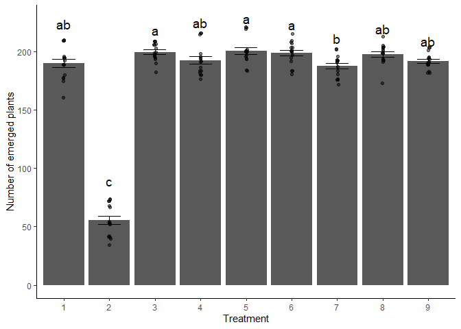

# Question 1

``` r
STAND <- read.csv("PlantEmergence.csv")
STAND$Treatment <- as.factor(STAND$Treatment)
STAND$DaysAfterPlanting <- as.factor(STAND$DaysAfterPlanting)
STAND$Rep <- as.factor(STAND$Rep)
str(STAND)
```

    ## 'data.frame':    144 obs. of  7 variables:
    ##  $ Plot             : int  101 102 103 104 105 106 107 108 109 201 ...
    ##  $ Treatment        : Factor w/ 9 levels "1","2","3","4",..: 1 2 3 4 5 6 7 8 9 6 ...
    ##  $ Rep              : Factor w/ 4 levels "1","2","3","4": 1 1 1 1 1 1 1 1 1 2 ...
    ##  $ Emergence        : num  180.5 54.5 195 198.5 202 ...
    ##  $ DatePlanted      : chr  "9-May-22" "9-May-22" "9-May-22" "9-May-22" ...
    ##  $ DateCounted      : chr  "16-May-22" "16-May-22" "16-May-22" "16-May-22" ...
    ##  $ DaysAfterPlanting: Factor w/ 4 levels "7","14","21",..: 1 1 1 1 1 1 1 1 1 1 ...

# Question 2

``` r
lm.full <- lm(Emergence ~ Treatment * DaysAfterPlanting, data = STAND)
summary(lm.full) 
```

    ## 
    ## Call:
    ## lm(formula = Emergence ~ Treatment * DaysAfterPlanting, data = STAND)
    ## 
    ## Residuals:
    ##     Min      1Q  Median      3Q     Max 
    ## -21.250  -6.062  -0.875   6.750  21.875 
    ## 
    ## Coefficients:
    ##                                  Estimate Std. Error t value Pr(>|t|)    
    ## (Intercept)                     1.823e+02  5.324e+00  34.229   <2e-16 ***
    ## Treatment2                     -1.365e+02  7.530e+00 -18.128   <2e-16 ***
    ## Treatment3                      1.112e+01  7.530e+00   1.477    0.142    
    ## Treatment4                      2.500e+00  7.530e+00   0.332    0.741    
    ## Treatment5                      8.750e+00  7.530e+00   1.162    0.248    
    ## Treatment6                      7.000e+00  7.530e+00   0.930    0.355    
    ## Treatment7                     -1.250e-01  7.530e+00  -0.017    0.987    
    ## Treatment8                      9.125e+00  7.530e+00   1.212    0.228    
    ## Treatment9                      2.375e+00  7.530e+00   0.315    0.753    
    ## DaysAfterPlanting14             1.000e+01  7.530e+00   1.328    0.187    
    ## DaysAfterPlanting21             1.062e+01  7.530e+00   1.411    0.161    
    ## DaysAfterPlanting28             1.100e+01  7.530e+00   1.461    0.147    
    ## Treatment2:DaysAfterPlanting14  1.625e+00  1.065e+01   0.153    0.879    
    ## Treatment3:DaysAfterPlanting14 -2.625e+00  1.065e+01  -0.247    0.806    
    ## Treatment4:DaysAfterPlanting14 -6.250e-01  1.065e+01  -0.059    0.953    
    ## Treatment5:DaysAfterPlanting14  2.500e+00  1.065e+01   0.235    0.815    
    ## Treatment6:DaysAfterPlanting14  1.000e+00  1.065e+01   0.094    0.925    
    ## Treatment7:DaysAfterPlanting14 -2.500e+00  1.065e+01  -0.235    0.815    
    ## Treatment8:DaysAfterPlanting14 -2.500e+00  1.065e+01  -0.235    0.815    
    ## Treatment9:DaysAfterPlanting14  6.250e-01  1.065e+01   0.059    0.953    
    ## Treatment2:DaysAfterPlanting21  3.500e+00  1.065e+01   0.329    0.743    
    ## Treatment3:DaysAfterPlanting21 -1.000e+00  1.065e+01  -0.094    0.925    
    ## Treatment4:DaysAfterPlanting21  1.500e+00  1.065e+01   0.141    0.888    
    ## Treatment5:DaysAfterPlanting21  2.875e+00  1.065e+01   0.270    0.788    
    ## Treatment6:DaysAfterPlanting21  4.125e+00  1.065e+01   0.387    0.699    
    ## Treatment7:DaysAfterPlanting21 -2.125e+00  1.065e+01  -0.200    0.842    
    ## Treatment8:DaysAfterPlanting21 -1.500e+00  1.065e+01  -0.141    0.888    
    ## Treatment9:DaysAfterPlanting21 -1.250e+00  1.065e+01  -0.117    0.907    
    ## Treatment2:DaysAfterPlanting28  2.750e+00  1.065e+01   0.258    0.797    
    ## Treatment3:DaysAfterPlanting28 -1.875e+00  1.065e+01  -0.176    0.861    
    ## Treatment4:DaysAfterPlanting28  3.726e-13  1.065e+01   0.000    1.000    
    ## Treatment5:DaysAfterPlanting28  2.500e+00  1.065e+01   0.235    0.815    
    ## Treatment6:DaysAfterPlanting28  2.125e+00  1.065e+01   0.200    0.842    
    ## Treatment7:DaysAfterPlanting28 -3.625e+00  1.065e+01  -0.340    0.734    
    ## Treatment8:DaysAfterPlanting28 -1.500e+00  1.065e+01  -0.141    0.888    
    ## Treatment9:DaysAfterPlanting28 -8.750e-01  1.065e+01  -0.082    0.935    
    ## ---
    ## Signif. codes:  0 '***' 0.001 '**' 0.01 '*' 0.05 '.' 0.1 ' ' 1
    ## 
    ## Residual standard error: 10.65 on 108 degrees of freedom
    ## Multiple R-squared:  0.9585, Adjusted R-squared:  0.945 
    ## F-statistic: 71.21 on 35 and 108 DF,  p-value: < 2.2e-16

``` r
anova(lm.full)
```

    ## Analysis of Variance Table
    ## 
    ## Response: Emergence
    ##                              Df Sum Sq Mean Sq  F value    Pr(>F)    
    ## Treatment                     8 279366   34921 307.9516 < 2.2e-16 ***
    ## DaysAfterPlanting             3   3116    1039   9.1603 1.877e-05 ***
    ## Treatment:DaysAfterPlanting  24    142       6   0.0522         1    
    ## Residuals                   108  12247     113                       
    ## ---
    ## Signif. codes:  0 '***' 0.001 '**' 0.01 '*' 0.05 '.' 0.1 ' ' 1

# Question 3

**Since the p-value for interaction term from ANOVA is greater than
0.05, indicating it not being significant so we don’t need to fit the
interaction term**

``` r
lm.simple <- lm(Emergence ~ Treatment + DaysAfterPlanting, data = STAND)
summary(lm.simple)
```

    ## 
    ## Call:
    ## lm(formula = Emergence ~ Treatment + DaysAfterPlanting, data = STAND)
    ## 
    ## Residuals:
    ##      Min       1Q   Median       3Q      Max 
    ## -21.1632  -6.1536  -0.8542   6.1823  21.3958 
    ## 
    ## Coefficients:
    ##                     Estimate Std. Error t value Pr(>|t|)    
    ## (Intercept)          182.163      2.797  65.136  < 2e-16 ***
    ## Treatment2          -134.531      3.425 -39.277  < 2e-16 ***
    ## Treatment3             9.750      3.425   2.847  0.00513 ** 
    ## Treatment4             2.719      3.425   0.794  0.42876    
    ## Treatment5            10.719      3.425   3.129  0.00216 ** 
    ## Treatment6             8.812      3.425   2.573  0.01119 *  
    ## Treatment7            -2.188      3.425  -0.639  0.52416    
    ## Treatment8             7.750      3.425   2.263  0.02529 *  
    ## Treatment9             2.000      3.425   0.584  0.56028    
    ## DaysAfterPlanting14    9.722      2.283   4.258 3.89e-05 ***
    ## DaysAfterPlanting21   11.306      2.283   4.951 2.21e-06 ***
    ## DaysAfterPlanting28   10.944      2.283   4.793 4.36e-06 ***
    ## ---
    ## Signif. codes:  0 '***' 0.001 '**' 0.01 '*' 0.05 '.' 0.1 ' ' 1
    ## 
    ## Residual standard error: 9.688 on 132 degrees of freedom
    ## Multiple R-squared:  0.958,  Adjusted R-squared:  0.9545 
    ## F-statistic: 273.6 on 11 and 132 DF,  p-value: < 2.2e-16

``` r
anova(lm.simple)
```

    ## Analysis of Variance Table
    ## 
    ## Response: Emergence
    ##                    Df Sum Sq Mean Sq F value    Pr(>F)    
    ## Treatment           8 279366   34921 372.070 < 2.2e-16 ***
    ## DaysAfterPlanting   3   3116    1039  11.068 1.575e-06 ***
    ## Residuals         132  12389      94                      
    ## ---
    ## Signif. codes:  0 '***' 0.001 '**' 0.01 '*' 0.05 '.' 0.1 ' ' 1

**From the summary table, intercept is the mean emergence for baseline
levels.: 182.163 and coefficient for treatment 2 is the difference in
mean emergence between Treatment 2 and intercept (-134.531): 134.531
less emergence than reference level**

# Question 4

``` r
lsmeans_trt <- emmeans(lm.simple, ~ Treatment)
Results_lsmeans <- cld(lsmeans_trt, alpha = 0.05, reversed = TRUE, Letters = letters)
Results_lsmeans
```

    ##  Treatment emmean   SE  df lower.CL upper.CL .group
    ##  5          200.9 2.42 132    196.1    205.7  a    
    ##  3          199.9 2.42 132    195.1    204.7  a    
    ##  6          199.0 2.42 132    194.2    203.8  a    
    ##  8          197.9 2.42 132    193.1    202.7  ab   
    ##  4          192.9 2.42 132    188.1    197.7  ab   
    ##  9          192.2 2.42 132    187.4    196.9  ab   
    ##  1          190.2 2.42 132    185.4    194.9  ab   
    ##  7          188.0 2.42 132    183.2    192.8   b   
    ##  2           55.6 2.42 132     50.8     60.4    c  
    ## 
    ## Results are averaged over the levels of: DaysAfterPlanting 
    ## Confidence level used: 0.95 
    ## P value adjustment: tukey method for comparing a family of 9 estimates 
    ## significance level used: alpha = 0.05 
    ## NOTE: If two or more means share the same grouping symbol,
    ##       then we cannot show them to be different.
    ##       But we also did not show them to be the same.

\*\* Means followed by Same letter are not significantly different.
Treatments 5, 3, and 6 had the highest emergence and were not
significantly different from each other. Treatment 2 had the lowest
emergence and was significantly lower than all other treatments.
Treatments in group “ab” (including 8, 4, 9, and 1) had intermediate
values and were not significantly different from either the highest or
the next-lower group. Treatment 7 was significantly lower than the top
group but not different from treatments in the “ab” group.\*\*

# Question 5

``` r
# Provided code
plot_cldbars_onefactor <- function(lm_model, factor) {
  data <- lm_model$model
  variables <- colnames(lm_model$model)
  dependent_var <- variables[1]
  independent_var <- variables[2:length(variables)]

  lsmeans <- emmeans(lm_model, as.formula(paste("~", factor)))
  Results_lsmeans <- cld(lsmeans, alpha = 0.05, reversed = TRUE, details = TRUE, Letters = letters)

  sig.diff.letters <- data.frame(Results_lsmeans$emmeans[,1], 
                                 str_trim(Results_lsmeans$emmeans[,7]))
  colnames(sig.diff.letters) <- c(factor, "Letters")

  ave_stand2 <- lm_model$model %>%
    group_by(!!sym(factor)) %>%
    summarize(
      ave.emerge = mean(.data[[dependent_var]], na.rm = TRUE),
      se = sd(.data[[dependent_var]]) / sqrt(n())
    ) %>%
    left_join(sig.diff.letters, by = factor) %>%
    mutate(letter_position = ave.emerge + 10 * se)

  plot <- ggplot(data, aes(x = !! sym(factor), y = !! sym(dependent_var))) + 
    stat_summary(fun = mean, geom = "bar") +
    stat_summary(fun.data = mean_se, geom = "errorbar", width = 0.5) +
    ylab("Number of emerged plants") + 
    geom_jitter(width = 0.02, alpha = 0.5) +
    geom_text(data = ave_stand2, aes(label = Letters, y = letter_position), size = 5) +
    xlab(as.character(factor)) +
    theme_classic()

  return(plot)
}

# Plot using the simplified model and Treatment
plot_cldbars_onefactor(lm.simple, "Treatment")
```

<!-- -->

**The letters above the bars represent statistically distinct groups.
Treatments sharing a letter are not significantly different, while those
with different letters show significant differences in emergence.**
