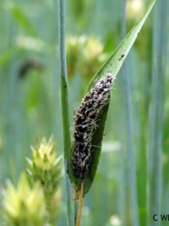

```{r Install Tinytex, eval=FALSE}
install.packages('tinytex')
tinytex::install_tinytex()
```

```{r setup, include=FALSE}
knitr::opts_chunk$set(echo = TRUE)
library(knitr)
library(ggplot2)
library(markdown)

```


```{r}
data("mtcars")
ggplot(mtcars, aes(x = wt, y = mpg)) +
  geom_smooth(method = lm, se = FALSE) +
  geom_point(aes(color = wt)) +
  xlab("Weight") + 
  ylab("Miles per gallon") +
  scale_colour_gradient(low = "forestgreen", high = "black")
```

# First-level header

## Second-level header

### Third-level header
*italic*
_italic_
**bold**
__bold__
> "I thoroughly disapprove of duels. If a man should challenge me,
  I would take him kindly and forgivingly by the hand and lead him
  to a quiet place and kill him."
>
> --- Mark Twain

- one item
- one item
- one item
    - one more item
    - one more item
    - one more item
    
1. the first item
2. the second item
3. the third item
    - one unordered item
    - one unordered item


https://agriculture.auburn.edu/about/directory/faculty/zachary-noel/
<https://agriculture.auburn.edu/about/directory/faculty/zachary-noel/>
[Noel Lab](https://agriculture.auburn.edu/about/directory/faculty/zachary-noel/)



First Header  | Second Header
------------- | -------------
Content Cell  | Content Cell
Content Cell  | Content Cell

```{r}
kable(head(mtcars, n = 5), digits = 3, format = "markdown")
```


- [Coding Pratice 4](Coding Practice 4.Rmd)

## File Tree 
not sure why but only got this 
```
.
├── Coding Challenge3PC_KKB.R
├── Coding Practice 4.Rmd
├── Coding-Practice-4.docx
├── Coding-Practice-4.html
├── Coding-Practice-4.md
├── Coding-Practice-4_files
│   ├── figure-gfm
│   │   ├── pressure-1.png
│   │   └── unnamed-chunk-1-1.png
│   └── figure-html
├── cornsmut_bright.webp
├── Mycotoxin.Rproj
├── MycotoxinData.csv
├── Picture.jpg
├── README.html
└── README.md
```

## DOI release for Zenodo

DOI: 10.5281/zenodo.14940583

- [DOI](https://zenodo.org/records/14940583)


