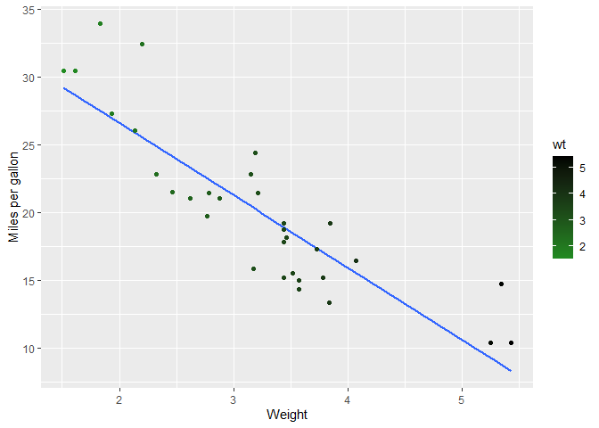

``` r
install.packages('tinytex')
tinytex::install_tinytex()
```

``` r
data("mtcars")
ggplot(mtcars, aes(x = wt, y = mpg)) +
  geom_smooth(method = lm, se = FALSE) +
  geom_point(aes(color = wt)) +
  xlab("Weight") + 
  ylab("Miles per gallon") +
  scale_colour_gradient(low = "forestgreen", high = "black")
```

    ## `geom_smooth()` using formula = 'y ~ x'

<!-- -->

# First-level header

## Second-level header

### Third-level header

*italic* *italic* **bold** **bold** \> “I thoroughly disapprove of
duels. If a man should challenge me, I would take him kindly and
forgivingly by the hand and lead him to a quiet place and kill him.” \>
\> — Mark Twain

- one item
- one item
- one item
  - one more item
  - one more item
  - one more item

1.  the first item
2.  the second item
3.  the third item
    - one unordered item
    - one unordered item

<https://agriculture.auburn.edu/about/directory/faculty/zachary-noel/>
<https://agriculture.auburn.edu/about/directory/faculty/zachary-noel/>
[Noel
Lab](https://agriculture.auburn.edu/about/directory/faculty/zachary-noel/)

\![Smut\] (Picture.jpg)
